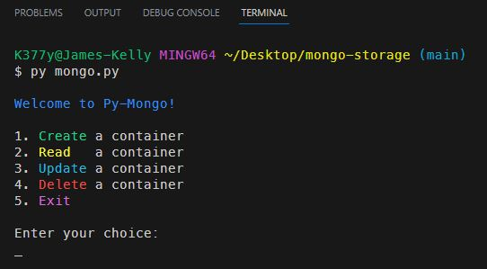
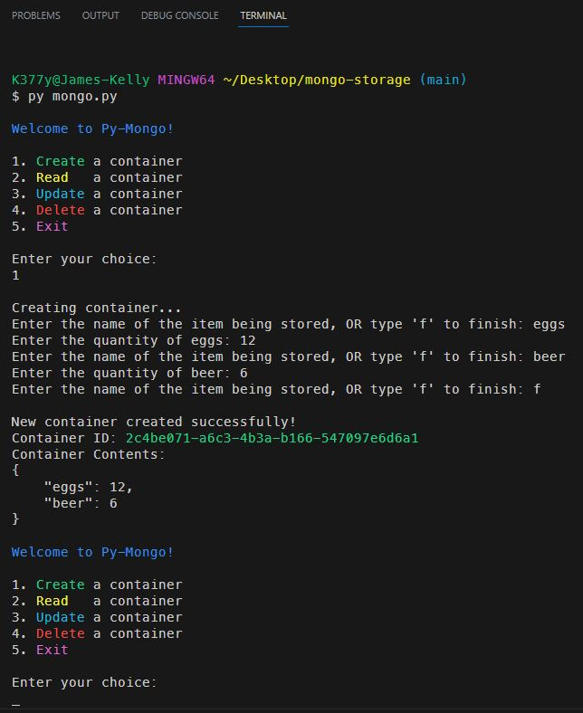
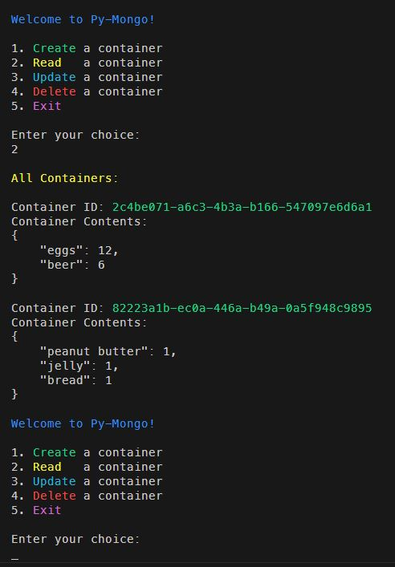
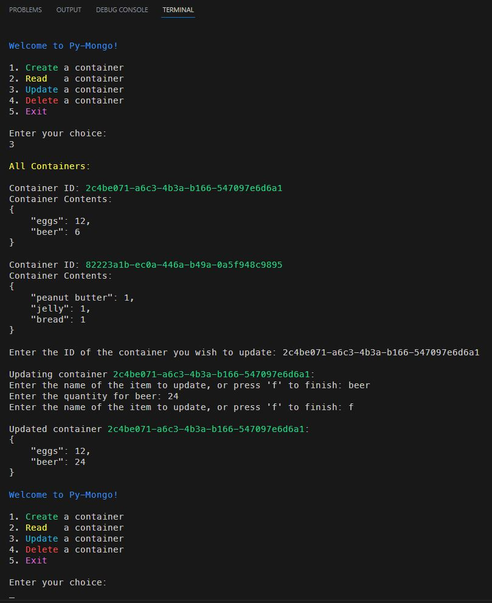
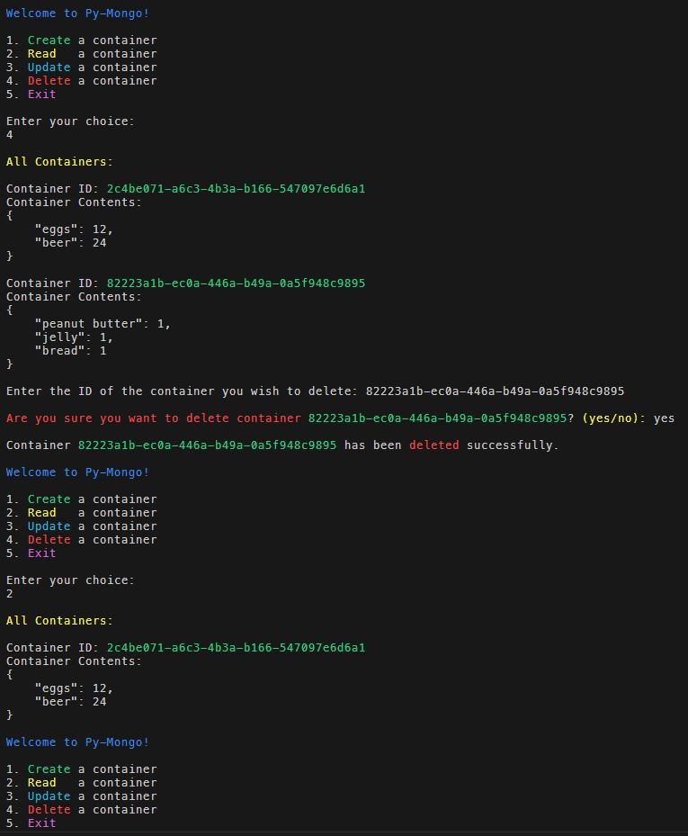

# Python MongoDB Storage

 

## Description
This is my first Python application that will use MongoDB for storage. It will exercise all basic CRUD operations to manipulate the database.
 

### ***Some notes about the Python pymongo module:*** 
 - The module provides classes and methods to connect to a MongoDB server, select databases and collections, and perform operations on documents within collections. 
 - You can perform CRUD operations (Create, Read, Update, Delete) on documents using methods like insert_one(), find(), update_one(), delete_one(), etc. 
 - Pymongo can handle different data types, including strings, numbers, dates, arrays, embedded documents, and more. 
 - It also supports both synchronous and asynchronous programming paradigms, allowing you to choose the style that best fits your application's needs. 

### ***Some notes about the Python uuid module:*** 
 - UUIDs are useful for generating unique identifiers in various applications, such as database records, distributed systems, and network protocols. 
 - UUIDs are typically represented as strings in the format "xxxxxxxx-xxxx-xxxx-xxxx-xxxxxxxxxxxx", where each "x" represents a hexadecimal digit. 
 - You can convert a UUID to and from its string representation using the str() and uuid.UUID() functions, respectively. 

### ***Some notes about the Python json module:*** 
 - The json module allows you to encode (serialize) Python objects into JSON format and decode (deserialize) JSON data into Python objects. 
 - json.dumps() is used to convert a Python object into a JSON string representation. 
 - json.loads() is used to parse a JSON string and convert it back into a Python object. 
 - The module supports pretty printing of JSON data for better readability using the json.dumps() function with the indent parameter. 

## *Installation & Usage*
To install this app, simply clone the repository and run the `mongo.py` file in your terminal. 
I have left the username and password in the code so anyone can play with this database in the cloud. 
 

 

### When prompted: 
Choose one of the options by typing the corresponding number and pressing enter. 

- If you choose to create a new container, you will be prompted to enter the container's information. 
 

- If you choose to Read, it will display ALL of the containers and their content. 
 

- If you choose to update a container, you will be prompted to enter the container_id of the container you wish to update, and then you will select which data you wish to change. 
 

- If you choose to delete a container, you will be prompted to enter the container_id of the container you wish to delete, then asked for confirmation to delete. 
 

- If you choose to exit the application, the application will close. 
 
 

## *Questions*
<h3>Portfolio:&emsp;<a href="https://jk377y.dev" target="_blank">https://jk377y.dev</a></h3>
<h3>Email:&emsp;<a href="mailto:jk377y@gmail.com" target="_blank">jk377y@gmail.com</a></h3>
<h3>LinkedIn:&emsp;<a href="https://www.linkedin.com/in/james-kelly-software-developer/" target="_blank">https://www.linkedin.com/in/james-kelly-software-developer/</a></h3>
<h3>GitHub:&emsp;<a href="https://github.com/jk377y" target="_blank">https://github.com/jk377y</a></h3>
 

## *License*

 Copyright (c) 2023 James Kelly
 Information on this license can be found at: (https://opensource.org/licenses/MIT)